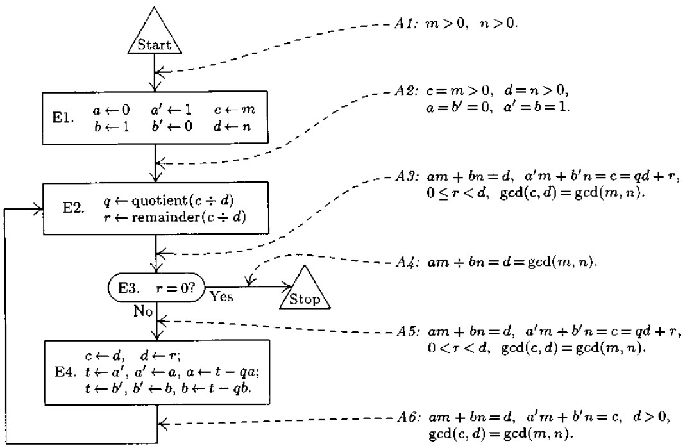

**Algorithm E** (*Extended Euclid's algorithm*). Given two positive
integers *m* and *n*, we compute their greatest common divisor *d* and
two integers *a* and *b*, such that $am + bn = d$.

**E1.** \[Initialize.\] Set $a \gets b \gets 1$, $a \gets b' \gets 0$,
$c \gets m$, $d \gets n$.

**E2.** \[Divide.\] Let *q* and *r* be the quotient and remainder,
respectively, of *c* divided by *d*. (We have $c = qd + r$ and
$0\leq r \leq d$.)

**E3.** \[Remainder zero?\] If $r = 0$, the algorithm terminates; we
have in this case $am + bn = d$ as desired.

**E4.** \[Recycle.\] Set $c \gets d$, $d \gets r$, $t \gets a'$,
$a' \gets a$, $a \gets t - qa$, $t \gets b'$, $b' \gets b$,
$b \gets t - qb$, and go back to E2.

**My remarks**

Let we found
$x_1, y_1 : b \cdot x_1 + (a \bmod b) \cdot y_1 = gcd(a, b)$. Obviously,
that $a \bmod {b} = a - \lfloor \dfrac{a}{b} \rfloor \cdot b$. We have:

$b \cdot x_1 + (a\bmod {b}) \cdot y_1 = b \cdot x_1 + (a - \lfloor \dfrac {a} {b} \rfloor \cdot b) \cdot y_1 = b \cdot (x_1 - \lfloor \dfrac{a}{b} \rfloor \cdot y_1) + a \cdot y_1 = a \cdot y_1 + b \cdot (x_1 - \lfloor \dfrac{a}{b} \rfloor \cdot y_1)$

**Resources**

[ITMO university
wiki](https://neerc.ifmo.ru/wiki/index.php?title=%D0%9D%D0%B0%D0%B8%D0%B1%D0%BE%D0%BB%D1%8C%D1%88%D0%B8%D0%B9_%D0%BE%D0%B1%D1%89%D0%B8%D0%B9_%D0%B4%D0%B5%D0%BB%D0%B8%D1%82%D0%B5%D0%BB%D1%8C#:~:text=%D1%8D%D1%84%D1%84%D0%B5%D0%BA%D1%82%D0%B8%D0%B2%D0%B5%D0%BD%2C%20%D1%87%D0%B5%D0%BC%20%D0%BA%D0%BB%D0%B0%D1%81%D1%81%D0%B8%D1%87%D0%B5%D1%81%D0%BA%D0%B8%D0%B9.-,%D0%A0%D0%B0%D1%81%D1%88%D0%B8%D1%80%D0%B5%D0%BD%D0%BD%D1%8B%D0%B9%20%D0%B0%D0%BB%D0%B3%D0%BE%D1%80%D0%B8%D1%82%D0%BC%20%D0%95%D0%B2%D0%BA%D0%BB%D0%B8%D0%B4%D0%B0,-%D0%92%20%D1%81%D1%82%D0%B0%D0%BD%D0%B4%D0%B0%D1%80%D1%82%D0%BD%D0%BE%D0%BC%20%D0%B0%D0%BB%D0%B3%D0%BE%D1%80%D0%B8%D1%82%D0%BC%D0%B5)