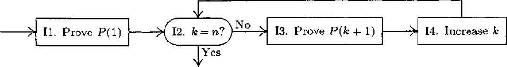

**Algorithm I** (*Construct a proof*). Given a positive integer *n*,
this algorithm will output a proof that *P*(*n*) is true.

**I1.** \[Prove *P*(1).\] Set $\textit{k}\gets1$, and, according to (a),
output a proof of *P*(1).

**I2.** \[*k* = *n*?\] If *k* = *n*, terminate the algorithm; the
required proof has been output.

**I3.** \[Prove *P*(*k*+ 1)\] According to (b), output a proof that "If
all of *P*(1),\...,*P*(*k*) are true, then *P*(*k* + 1) is true." Also
output "We have already proved *P*(1),\...,*P*(*k*); hence *P*(*k* + 1)
is true."

**I4.** \[Increase *k*.\] Increase *k* by 1 and go to step I2.

